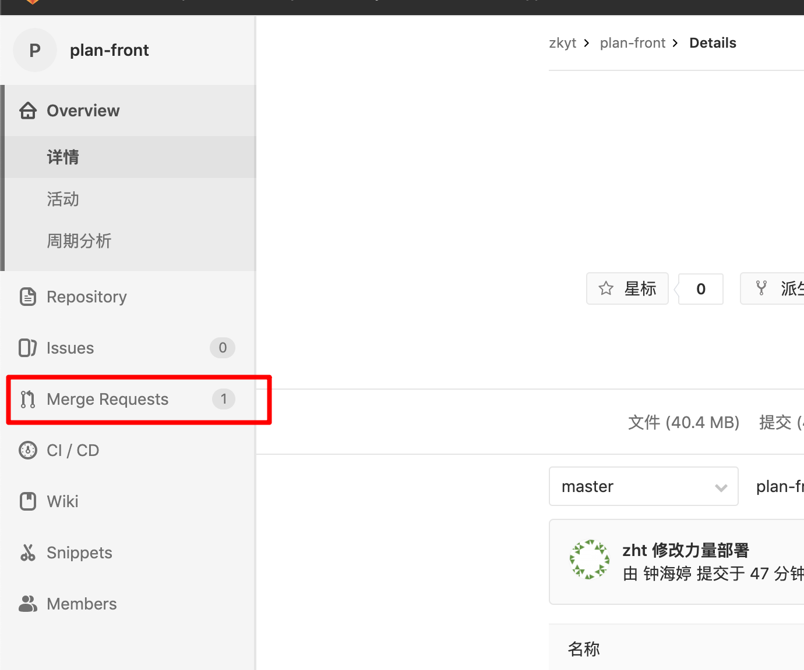

# Git使用规范

### 流模式
Git有很多工作流的方法论，基于目前团队，目前使用`集中式工作流`和`功能分支工作流`

* 集中式工作流：
  历史变更都直接提交到`master`分支
   
  集中式工作流适用一个人所负责的简单项目

* 功能分支工作流：
  解释详见[功能分支工作流](https://github.com/ivan-94/git-guide/blob/master/branch/feature.md)

基于团队使用gitlab，所以在上文2.3之后的操作为

### 分支命名约定

* master：主分支，永远是可用的、稳定的、可直接发布的版本，不能直接在该分支上开发。
* feature：功能开发分支
* issue：普通bug修复分支
* hotfix：紧急修复分支

### 提交规范

* feat: 添加新特性
* fix: 修复bug
* docs: 仅仅修改了文档
* style: 仅仅修改了空格、格式缩进、都好等等，不改变代码逻辑
* refactor: 代码重构，没有加新功能或者修复bug
* perf: 增加代码进行性能测试
* test: 增加测试用例
* chore: 改变构建流程、或者增加依赖库、工具等

### 使用工具(建议)

commit cz